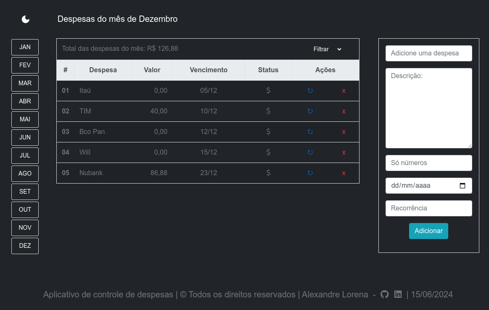

---

### 📚 Projeto de Extensão do Curso de Engenharia de Software 

---
- Univeridade Anhanguera Educacional
- EAD (Ampli)
- Plataforma Online para Controle de Despesas
---

### 🎯 Objetivo do Projeto

 Este projeto visa criar uma plataforma acessível e educativa que ajude indivíduos e famílias a controlar seus gastos e melhorar sua educação financeira. 
 
 Ao desenvolver habilidades de gestão financeira, os usuários estarão melhor preparados para enfrentar desafios econômicos e promover o desenvolvimento sustentável.

---

### 🚀 Ferramentas

- Frontend: HTML | CSS | JavaScript
- Backend: Python 3.8+ | Django
- Banco de Dados: PostgreSQL
- PyCharm / VScode

---

## Configuração do Ambiente

Este projeto usa variáveis de ambiente para configurar informações sensíveis. 
Para rodar o projeto localmente, siga os passos abaixo:

1. Crie um arquivo `.env` na raiz do projeto.
2. Copie o conteúdo de `.env.example` para o arquivo `.env`.
3. Substitua os valores de exemplo pelos seus próprios valores:

```plaintext
SECRET_KEY=your-secret-key
DEBUG=True
DATABASE_NAME=gastos
DATABASE_USER=your-database-user
DATABASE_PASSWORD=your-database-password
DATABASE_HOST=localhost
DATABASE_PORT=5432
```
---

## Como rodar o Projeto

Pré-requisitos:
- Python 3.8+
- Django==4.2.10
- PostgreSQL

Passos para Rodar:

- Clone o repositório: `git clone https://github.com/seu-usuario/gastos.git`
- Navegue até o diretório do projeto: `cd gastos`
- Instale as dependências: `pip install -r requirements.txt`
- Configure o banco de dados no arquivo `.env.`
- Aplique as migrações: `python manage.py migrate`
- Inicie o servidor de desenvolvimento: `python manage.py runserver`
- O projeto estará disponível em `http://127.0.0.1:8000/`

---

<div>
  <a href="mailto:alexandre.lorena@gmail.com" style="text-decoration: none;">
    </a>&nbsp;&nbsp;
  <a href="https://www.instagram.com/alexandre_lorena/" style="text-decoration: none;">
    </a>&nbsp;&nbsp; 
<a href="https://www.linkedin.com/in/alexandreluizlorena/" style="text-decoration: none;">
    </a>&nbsp;&nbsp;
  <a href="https://twitter.com/alefaith" style="text-decoration: none;">
    </a>&nbsp;&nbsp;
  <a href="https://www.youtube.com/@alefaith2008/featured" style="text-decoration: none;">
    </a>&nbsp;&nbsp;
  <a href="https://steamcommunity.com/id/alexandrelorena/" style="text-decoration: none;">
    </a>&nbsp;&nbsp;
  <a href="https://discord.com/channels/alelorena" style="text-decoration: none;">
    </a>
</div>
